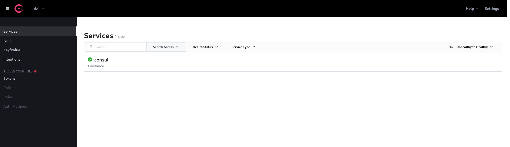

# Business Assistant Barcelona Backend Project


### Versiones necesarias

- Gradle 7.4.1
- Java 17

### Módulos del proyecto

- [BusinessAssistant-gateway](BusinessAssistant-gateway/README.md). 
- [BusinessAssistant-login](BusinessAssistant-login/README.md). Microservicio para manejo de login
- [BusinessAssistant-mydata](BusinessAssistant-mydata/README.md). 
- [BusinessAssistant-opendata](BusinessAssistant-opendata/README.md). Microservicio para manejo de información de [Opendata](https://opendata-ajuntament.barcelona.cat/es/api-cataleg)
- - [BusinessAssistant-opendata](BusinessAssistant-opendata/README.md). Microservicio para manejo de información de [datos.gob.es](https://datos.gob.es/es/catalogo)
- [BusinessAssistant-usermanagement](BusinessAssistant-usermanagement/README.md). Microservicio para gestión de usuarios.

## Ejecución de contenedores. Configuraciones 

### Consul

Pasos a seguir para inicialización de Consul en la aplicación y gestión de microservicios:

- Arrancar Docker en la máquina (UNIX based)

```
sudo systemctl start docker 
```
- Descargar imagen Docker. Véase [documentación oficial](https://hub.docker.com/_/consul).

```
docker pull consul
```

- Arrancar contenedor consul (desde directorio raíz)

```
docker-compose up consul-server1
```

- http://localhost:8500 debe mostrar consola de Administración Consul 

### Arranque de microservicios en Contenedor Docker

- Construcción del contenedor (UNIX based)

```
./start_container.sh
```


<hr/>

[](CODE_OF_CONDUCT_EN.md) 
 [](CODE_OF_CONDUCT_ES.md) 
  [](CODE_OF_CONDUCT_CA.md) 
